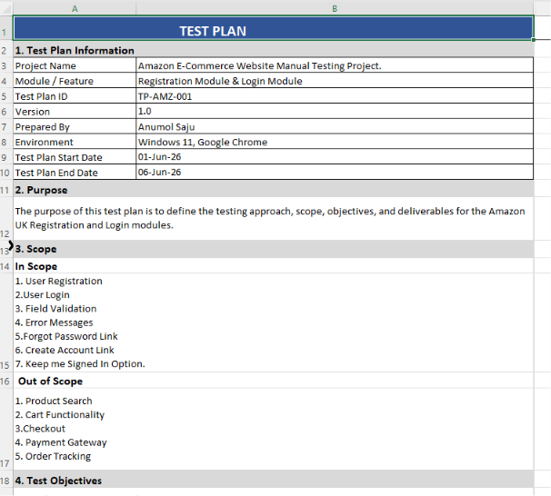
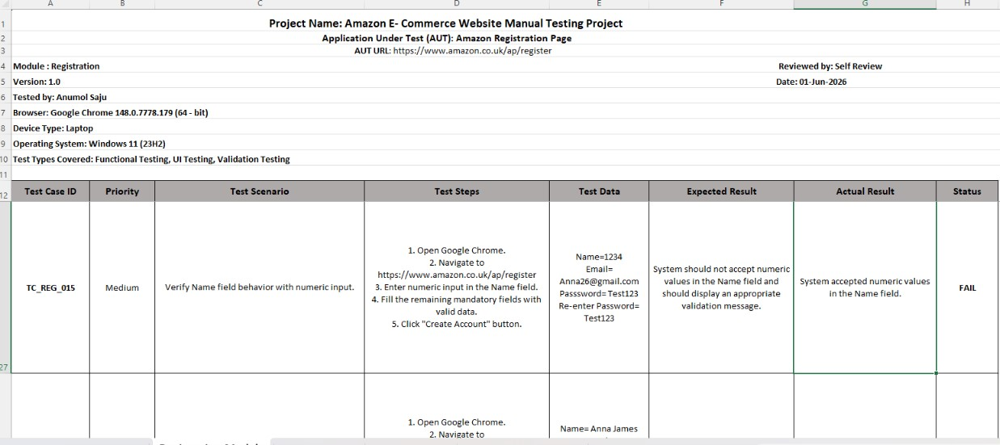
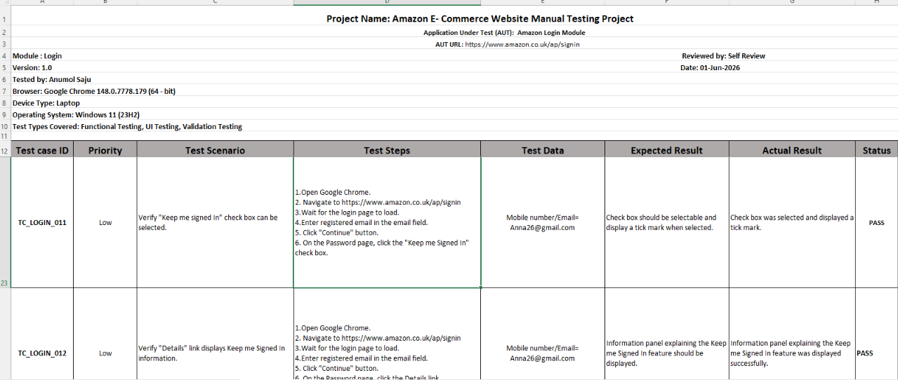
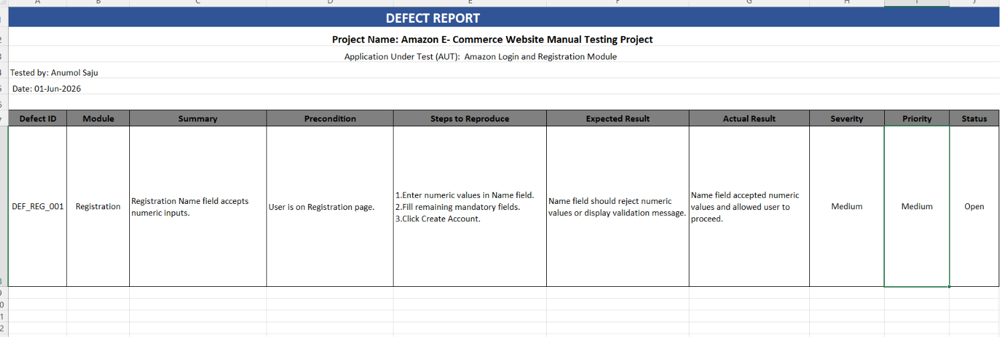
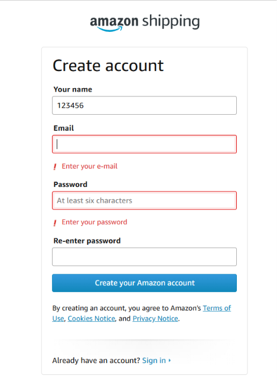
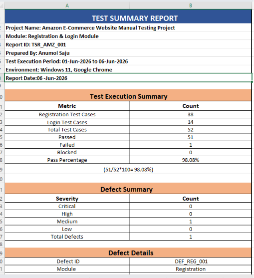
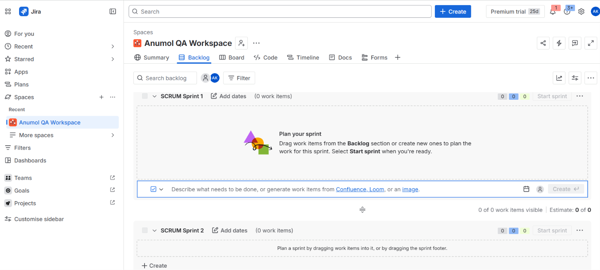
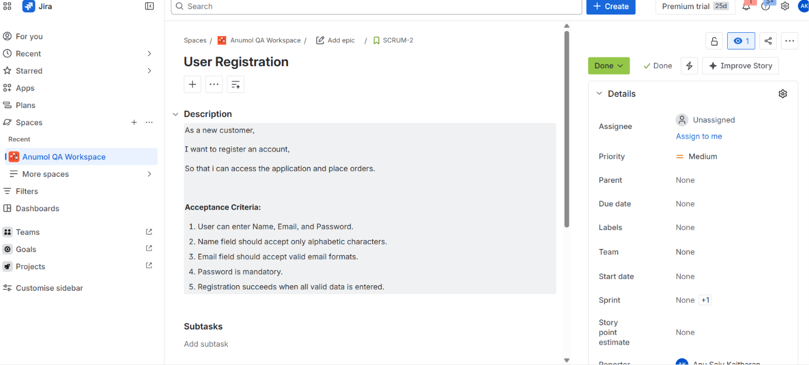
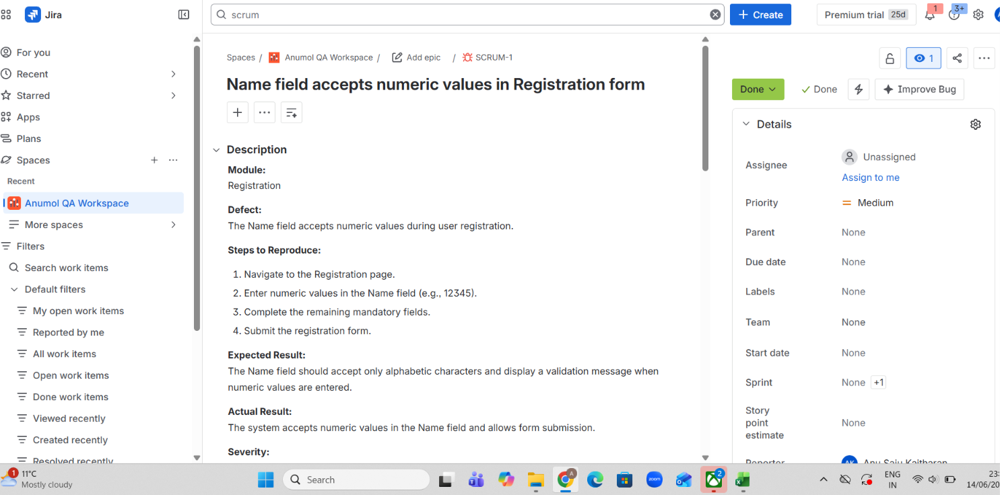
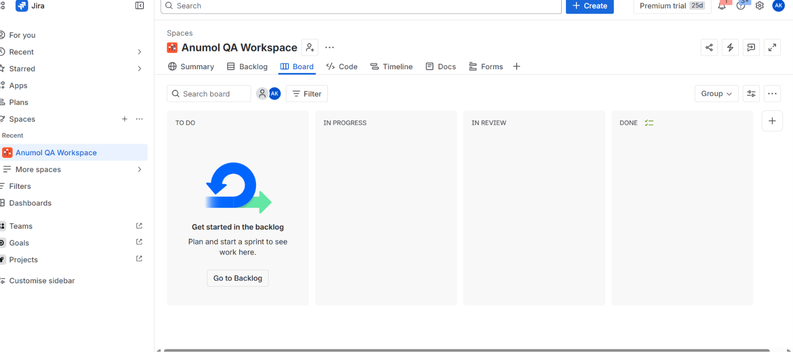

# Amazon-Ecommerce-Manual-Testing-Project
Manual Testing Project for Amazon UK Login and Registration Modules.
# Project Overview
This project demonstrates manual testing of the Amazon UK Login and Registration modules.
# Scope
- User Registration
- User Login
- Field Validation
- Error Messages
- Create Account Functionality
- Forgot Password Link
- Keep Me Signed In Option
  # Testing Activities
  - Test Planning
  - Test Case Design
  - Test Execution
  - Defect Reporting
  - Test Summary Reporting
  ## Test Execution Summary

| Metric | Count |
|---------|---------|
| Total Test Cases | 52 |
| Passed | 51 |
| Failed | 1 |
| Blocked | 0 |
| Pass Percentage | 98.08% |
## Defect Identified

**Defect ID:** DEF_REG_001

**Module:** Registration

**Summary:** Registration Name field accepts numeric inputs.

**Expected Result:** Name field should reject numeric inputs or display a validation message.

**Actual Result:** Name field accepts numeric values and allows user registration.

**Severity:** Medium
## Tools Used
- Microsoft Excel
- GitHub
- Google Chrome
 ## Project Structure
- Test Plan
- Registration Module Test Cases
- Login Module Test Cases
- Defect Report
- Test Summary Report
## Screenshots

### Test Plan

### Registration Module Test Cases

### Login Module Test Cases

### Defect Report

### Defect Evidence

### Test Summary Report

## Test Environment
- OS:Windows 11
- Browser: Google Chrome
- Testing Type: Manual Testing

  ## Jira Project Management

This project was managed using Jira Scrum methodology.

### User Stories
- User Registration
- Registration Form Validation

### Sprint Planning
- Sprint 1: Registration Module Testing
- Sprint 2: Defect Tracking and Sprint Completion

### Jira Workflow
TO DO → IN PROGRESS → DONE

### Jira Evidence

#### Product Backlog

#### User Story

#### Bug Created

#### Sprint Completed

  # Author
  Anumol Saju
